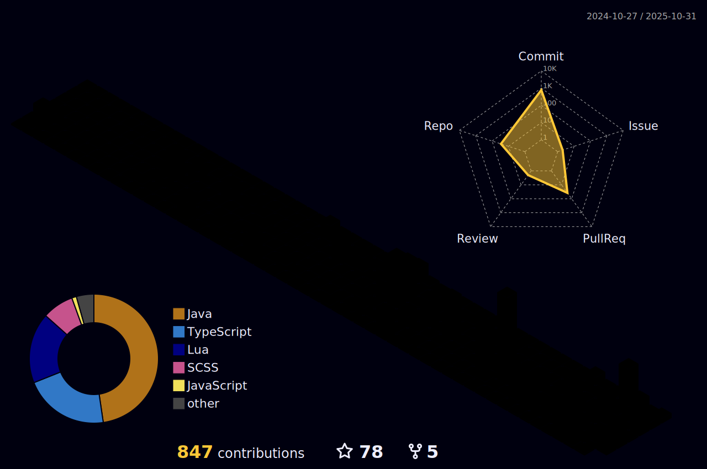

<!-- Typing Dynamic Text -->
<div align="center">
  
  <br>
</div>

<!-- Contact Badges -->
<div align="center">
  <a href="https://linkedin.com/in/adryan-claro" target="_blank">
    
  </a>
  <a href="mailto:adryan.contatoprofissional@gmail.com">
    
  </a>
</div>

<!-- Profile Views -->
<div align="center">
  
</div>
<br>

```fish
> fastfetch
```


```csharp
MrClaro@github
-------------------------
OS: Arch Linux x86_64
Shell: fish 5.8
Pronouns: He/Him
Location: São Paulo, Brazil
My Environment: Arch Linux, Hyprland, Ghostty, Neovim
Frameworks: Spring Boot, NestJS, Express, NextJS, Angular
Languages: Java, Python, JavaScript, TypeScript,
           HTML, CSS
Testing: JUnit, Jest
Databases: MySQL, PostgreSQL, MongoDB, Redis
ORMs: Prisma, Drizzle, Hibernate
Tools: GitHub, Docker, Vercel, VSCode, IntelliJ IDEA
Hobbies: Coding, Reading, Gaming, Martial Arts, Ricing
```
---

<!-- 3D Profile -->



<!-- Animated Pacman -->
<picture>
  <source media="(prefers-color-scheme: dark)" srcset="https://raw.githubusercontent.com/MrClaro/MrClaro/output/pacman-contribution-graph-dark.svg">
  <source media="(prefers-color-scheme: light)" srcset="https://raw.githubusercontent.com/MrClaro/MrClaro/output/pacman-contribution-graph.svg">
  
</picture>

---

<!-- Trophy -->
<div align="center">
  
</div>

<br>
<div align="center">
    
</div>


